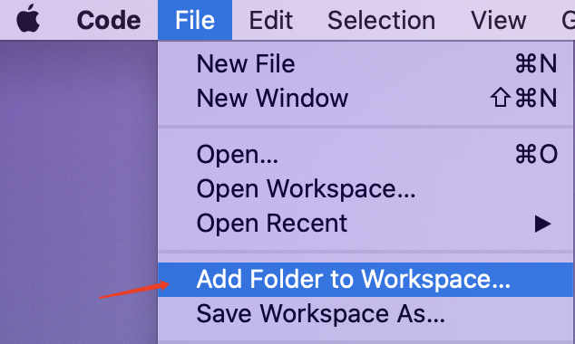
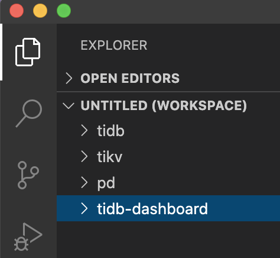
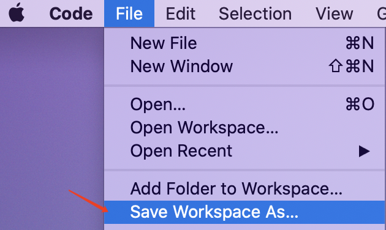
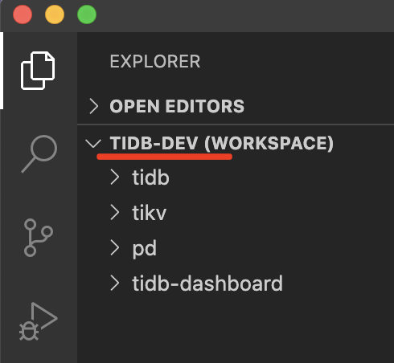

# Step By Step Guide

## Clone and import repos

At frist you need to clone all repos (tidb/tikv/pd/tidb-dashboard) to local if you don't do it before.

```shell
$ mkdir repos
$ git clone https://github.com/pingcap/tidb.git
$ git clone https://github.com/pingcap/tikv.git
$ git clone https://github.com/pingcap/pd.git
$ git clone https://github.com/pingcap/tidb-dashboard.git
```

Open any repo in VSCode, for example tidb, then choose menu "File / Add Folder to Workspace...", add all other repo folder to VSCode. The VSCode will automatically organize them as a untitled workspace.





Save the workspace by the menu "File / Save Workspace as ..." to any path, for example save it as "tidb-dev.code-workspace".





## Setup build tools

(Currently, we need to manually setup them, we try to automate it later.)

Required tools for building:

1. TiDB

   - See https://github.com/pingcap/community/blob/master/contributors/README.md for details
   - [`Go 1.13+`](https://golang.org/doc/install)

1. TiKV

   - See tikv/CONTRIBUTING.md for details
   - [rustup](https://rustup.rs/) - Rust installer and toolchain manager
   - `make` - Build tool (run common workflows)
   - `cmake` - Build tool (required for gRPC)
   - `awk` - Pattern scanning/processing language

1. PD

   - See pd/README.md for details
   - [`Go 1.13+`](https://golang.org/doc/install)

1. TiDB-Dashboard

   - See tidb-dashboard/CONTRIBUTING.md for details
   - `make` - Build tool (run common workflows)
   - [`Golang 1.13+`](https://golang.org/) - To compile the server
   - [`Node.js 12+`](https://nodejs.org/) - To compile the front-end
   - [`Yarn 1.21+`](https://classic.yarnpkg.com/en/docs/install) - To manage front-end dependencies
   - [`Java 8+`](https://www.java.com/en/download/) - To generate JavaScript API client by OpenAPI specification (so pity, but it's true we need it)

## Start playground with modified code
